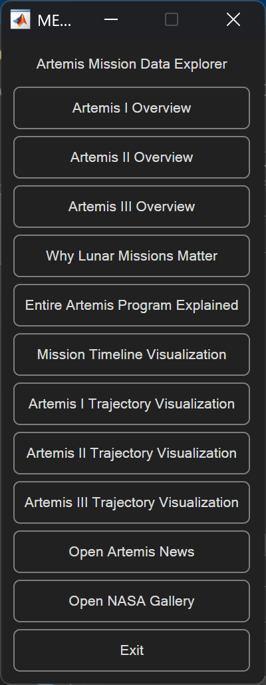

# Project Information

## 1. Folder Structure

```
matlab-artemis-explorer/
│
├── src/                # Main MATLAB code
├── docs/               # Reports or documentation
├── images/             # Screenshots and visuals
├── README.md
└── INFORMATION.md

```

---

## 2. How to Run

1. Open MATLAB
2. Navigate to the `src/` folder
3. Run the main script:

   ```
   main.m
   ```
4. Follow the on-screen prompts to explore mission data

---

## 3. Demo

## Demo

### Interface


### Data Visualization


---

## 4. Features Overview

* Mission summaries
* Interactive query system
* Data visualization (plots, charts)
* Media references
* Concept exploration mode

---

## 5. Limitations

* Uses keyword-based parsing (not full natural language processing)
* Static datasets (no live API integration)
* MATLAB-only interface

---

## 6. Roadmap

* Add natural language processing
* Expand beyond Artemis missions
* Convert to web-based interface
* Integrate real-time NASA APIs

---

## 7. Project Report

Stored in the `docs/` folder.

---

## 8. Notes

This file provides extended technical and usage information beyond the main README.
